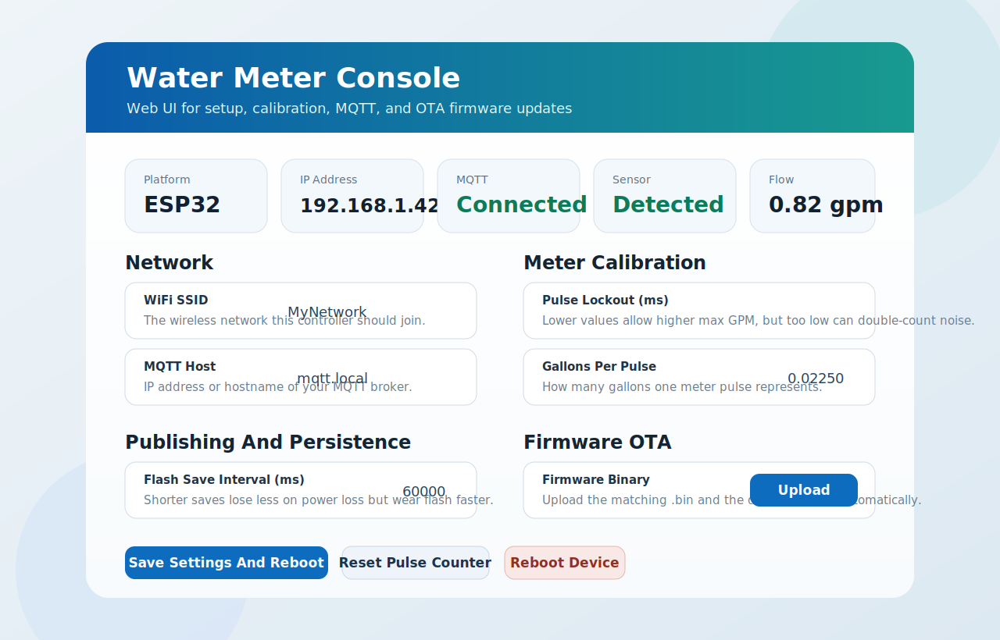
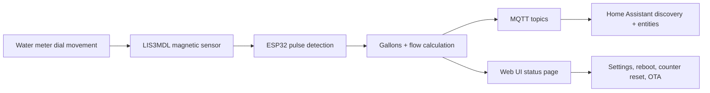

# Water Meter Firmware

ESP32-based water meter firmware for reading a water meter with a LIS3MDL magnetic sensor and publishing usage to MQTT and Home Assistant.

It includes:

- a browser-based Web UI for setup and tuning
- Home Assistant MQTT discovery
- browser-based OTA firmware updates
- persistent settings stored on the device
- flow-rate and leak-state reporting

## Install In Browser

[Launch Web Installer](https://esphome.github.io/esp-web-tools/?manifest=https://raw.githubusercontent.com/sushionmyear/Water-Meter/main/docs/installer/manifest.json)

Browser install works best with a Chromium-based desktop browser such as Chrome, Edge, or Brave and a USB data cable.

What the browser installer does:

- flashes a factory image to a blank ESP32
- starts a built-in setup network if Wi-Fi is not configured yet
- lets the Web UI and built-in OTA handle future updates

After the first install, normal updates can be done from the device Web UI using the OTA section.



## What It Does

The firmware watches the magnetic field near the meter, detects pulses as the dial moves, converts those pulses into gallons, and publishes the results over MQTT.

Main outputs:

- total gallons
- flow rate in GPM
- leak state
- RSSI
- optional magnetic debug value

## How It Works



## Web UI

The built-in Web UI is designed to handle normal day-to-day management without code changes.

From the Web UI you can:

- change Wi-Fi settings
- change MQTT broker settings
- tune pulse detection thresholds
- adjust gallons-per-pulse calibration
- change publish and persistence intervals
- reset the pulse counter
- reboot the device
- upload new firmware over the air

## Hardware

Required hardware:

- ESP32 Dev Module / ESP32-WROOM-32U
- Adafruit LIS3MDL
- stable 5V USB power supply

ESP32 SPI wiring used by this project:

| LIS3MDL | ESP32 |
| --- | --- |
| `SCK` | `GPIO18` |
| `MISO` / `SDO` | `GPIO19` |
| `MOSI` / `SDA` | `GPIO23` |
| `CS` | `GPIO5` |
| `3.3V` | `3.3V` |
| `GND` | `GND` |

## Quick Start

### 1. Build

```powershell
pio run -e esp32dev
```

If `pio` is not on your PATH, build from PlatformIO in VS Code or run the PlatformIO executable directly from your local installation.

### 2. Flash over USB the first time

Build output:

- browser installer factory image: `docs/installer/water-meter-esp32-factory.bin`
- OTA image: `.pio/build/esp32dev/firmware.bin`

Typical first flash:

```powershell
pio run -e esp32dev -t upload
```

### 3. Connect to the setup network or your LAN

After boot, the controller does one of two things:

- if it already has working Wi-Fi credentials saved, it joins that network and prints its LAN IP on serial
- if it does not have valid Wi-Fi credentials yet, it starts a setup network named `WaterMeter-Setup-XXXX`

For a brand-new install, connect your phone or laptop to the setup network and open:

```text
http://192.168.4.1/
```

Some devices warn that the setup network has no internet access. That is expected.

### 4. Finish setup in the Web UI

Recommended first changes:

- confirm Wi-Fi settings
- confirm MQTT broker address
- choose your final `Base Topic`
- choose your final `Device ID`
- choose your final `Device Name`
- set `Mag Debug Publish (ms)` to `0` for normal use

When you save settings, the controller reboots. If the Wi-Fi settings are correct, the setup network turns off and the device becomes available on your normal LAN.

## OTA Firmware Updates

After the first USB flash or browser install, future updates can be done from the browser.

1. Build the firmware.
2. Open the device IP in your browser.
3. In `Firmware OTA`, upload `.pio/build/esp32dev/firmware.bin`.
4. Wait for the device to reboot.

OTA updates do not erase saved settings.

## Home Assistant

The firmware publishes Home Assistant MQTT discovery data automatically after connecting to MQTT.

Typical entities created:

- total water usage
- current flow rate
- Wi-Fi RSSI
- leak state
- magnetic debug sensor

Important settings:

- `Home Assistant Prefix`: usually `homeassistant`
- `Base Topic`: the live topic for this device
- `Device ID`: unique ID used in entity naming
- `Device Name`: friendly name shown in Home Assistant

## Important Settings

These are the settings most users are likely to adjust:

- `Gallons Per Pulse`: calibration value for your meter
- `Mag High Threshold`: level that counts a pulse
- `Mag Low Threshold`: level that re-arms the next pulse
- `Pulse Lockout (ms)`: minimum spacing between pulses; lower values allow higher max flow
- `Sensor Poll (ms)`: how often the LIS3MDL is sampled
- `Flash Save Interval (ms)`: how often pulse count is saved to flash
- `Leak Minimum Flow (gpm)`: minimum sustained flow before leak timing starts
- `Leak Minimum Duration (ms)`: how long flow must persist before leak state turns on

## MQTT Topics

With `Base Topic = home/water_meter`, the main topics are:

- `home/water_meter/status`
- `home/water_meter/total_gallons`
- `home/water_meter/flow_gpm`
- `home/water_meter/rssi`
- `home/water_meter/leak`
- `home/water_meter/mag_debug`
- `home/water_meter/cmd`

If `Enable MQTT RESET command` is turned on, publishing `RESET` to `<base_topic>/cmd` clears the counter.

## Troubleshooting

### Browser installer does not connect

- Use a desktop Chromium-based browser.
- Use a real USB data cable, not a charge-only cable.
- Close Arduino Serial Monitor or any app already using the COM port.
- Press reset on the ESP32 and try again.

### Web UI does not load

- If the board is new or Wi-Fi settings are wrong, connect to `WaterMeter-Setup-XXXX` and open `http://192.168.4.1/`.
- If the controller already joined your Wi-Fi, check the serial monitor for the LAN IP address.
- Verify you are opening the page from the same network as the device.

### Sensor shows as missing

- Recheck the SPI wiring.
- Confirm the LIS3MDL is powered from `3.3V`, not `5V`.
- Confirm `CS` is connected to `GPIO5`.

### Flow is too low or pulses are missed

- Lower `Pulse Lockout (ms)` carefully.
- Lower `Sensor Poll (ms)` if needed.
- Recheck sensor placement near the meter magnet.

### False counts or noisy readings

- Raise `Mag High Threshold`.
- Lower `Mag Low Threshold` only if the sensor is failing to re-arm.
- Set `Mag Debug Publish (ms)` to a small value temporarily so you can inspect the live magnetic value over MQTT.

### OTA upload fails

- Make sure you upload the matching ESP32 firmware binary.
- Wait for the current page to finish loading before uploading.
- Retry after a manual reboot if the device was left in an odd state by a previous failed update.

## Project Layout

- `platformio.ini` - PlatformIO environment for the ESP32 build
- `src/main.cpp` - Arduino entrypoint
- `src/WaterMeterApp.cpp` - firmware logic, Web UI, MQTT, OTA, persistence
- `include/WaterMeterApp.h` - app entrypoint declarations
- `docs/installer/` - browser installer manifest and firmware image
- `scripts/update-web-installer.ps1` - rebuilds the browser installer artifacts

## Maintainer Notes

To refresh the browser installer artifacts after firmware changes:

```powershell
.\scripts\update-web-installer.ps1
```

That script rebuilds the ESP32 firmware, creates a merged factory image for ESP Web Tools, and refreshes the OTA binary copy inside `docs/installer/`.

## Notes

- Default network and MQTT values in the source are placeholders for first-time setup.
- Saved settings persist across reboot and OTA updates.
- `.pio/` and `.vscode/` are ignored by Git.
